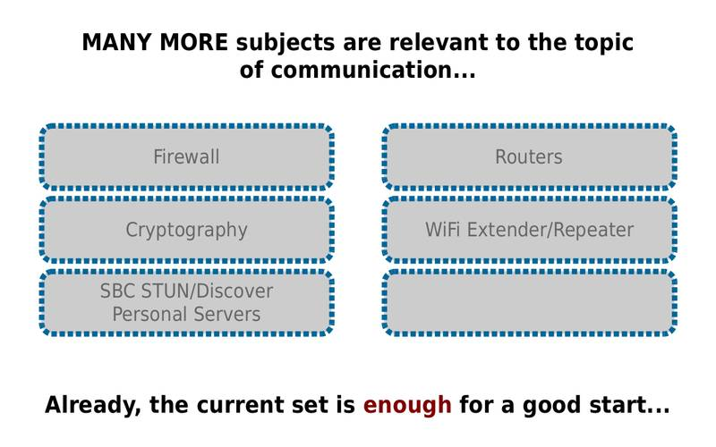

# P2P-Social-Proximity
P2P Tools for Social Proximity
  
  

  
---

  
---

  
---

  
---

  
---

  
---

  
---

  
---

  
---
  
  
**The WebeLive Word**  
The explanation for the word WebeLive is here:
https://github.com/t2age/webelive
  
  
**WebeLive Tutos**  
WebRTC P2P Connection Tuto  
https://github.com/t2age/webrtc-easy-power  
  
WebTorrent P2P-Cloud Transfer Tuto  
https://github.com/t2age/wl-seeder-getter  
  
P2P WiFi  
https://github.com/t2age/wl-p2p-wifi  
  
P2P Audio / Video  
https://github.com/t2age/wl-p2p-av  
  
P2P TwinFolder Entangled  
https://github.com/t2age/wl-p2p-twinfolder  
  
P2P WebRTC GUI - Graphical Interface APP  
https://github.com/t2age/p2p-wrtc-gui-app  
  
P2P Send File  
https://github.com/t2age/p2p-sendfile  
  
P2P WebCam Photo  
https://github.com/t2age/p2p-webcam-photo  
  
P2P ScreenShot  
https://github.com/t2age/p2p-screenshot  
  
P2P Walkie Talkie  
https://github.com/t2age/p2p-walktalk  
  
WL Cryptography Tutorial  
https://github.com/t2age/wl-cryptography  
  
  
And all stuff inside this "T2AGE" repository...  
  
  
.
